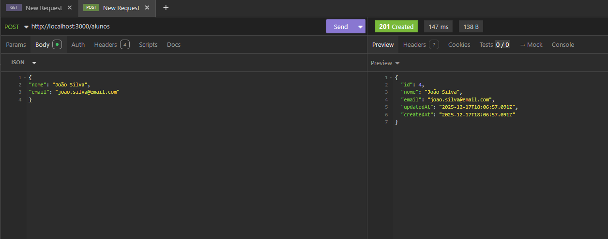
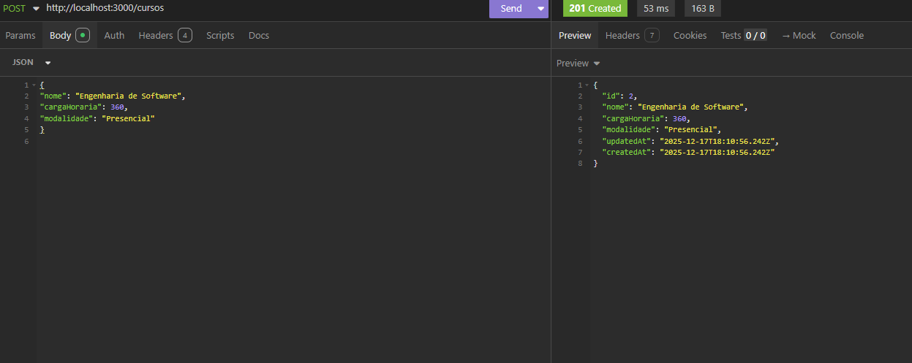
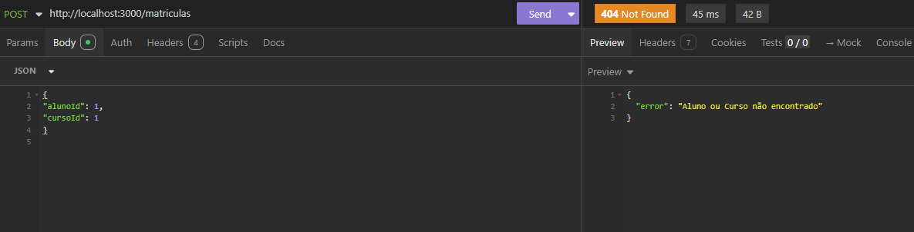
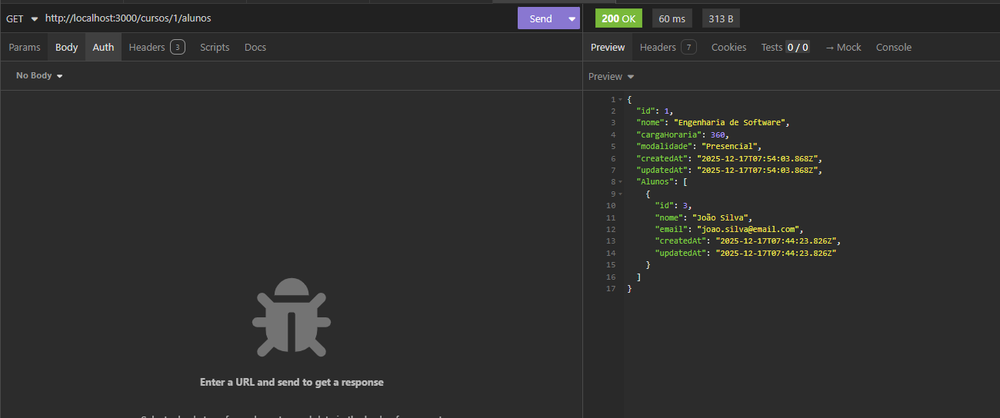
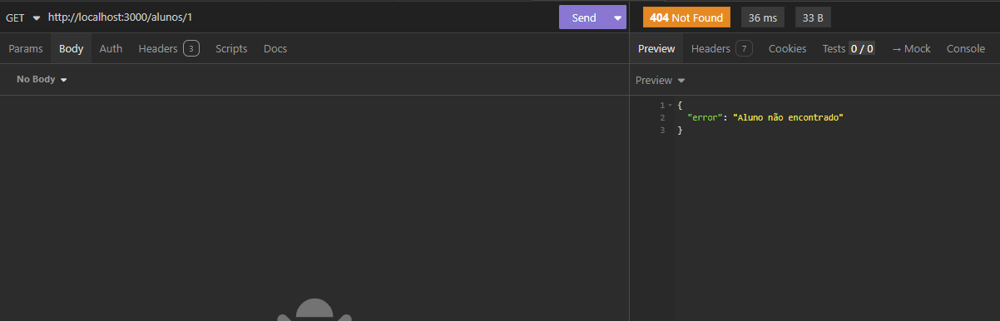

# Projeto-API
Projeto de aplicação em api


# Testes

Teste criar aluno


teste criar curso


teste criar matricula


teste consultar alunos de um curso


teste consultar curso de um aluno



-Criar a pasta do projeto

mkdir api-alunos-cursos
cd api-alunos-cursos

-Inicializar o Node.js

npm init -y

-Instalar dependências

### Dependências principais


npm install express sequelize sqlite3


### Dependências de desenvolvimento


npm install --save-dev sequelize-cli nodemon


-Inicializar o Sequelize CLI


npx sequelize-cli init


### Estrutura criada


config/
models/
migrations/
seeders/


-Configurar o banco SQLite

Edite **config/config.json**:

```json
{
  "development": {
    "dialect": "sqlite",
    "storage": "./database.sqlite"
  }
}
```

-Criar os models

### Aluno (nome e email obrigatórios)

```bash
npx sequelize-cli model:generate --name Aluno --attributes nome:string,email:string
```

Edite **models/aluno.js**:

```js
module.exports = (sequelize, DataTypes) => {
  const Aluno = sequelize.define('Aluno', {
    nome: {
      type: DataTypes.STRING,
      allowNull: false
    },
    email: {
      type: DataTypes.STRING,
      allowNull: false
    }
  });

  Aluno.associate = (models) => {
    Aluno.belongsToMany(models.Curso, {
      through: models.Matricula,
      foreignKey: 'alunoId'
    });
  };

  return Aluno;
};
```

---

### Curso

```bash
npx sequelize-cli model:generate --name Curso --attributes nome:string,cargaHoraria:integer,modalidade:string
```

**models/curso.js**:

```js
module.exports = (sequelize, DataTypes) => {
  const Curso = sequelize.define('Curso', {
    nome: DataTypes.STRING,
    cargaHoraria: DataTypes.INTEGER,
    modalidade: DataTypes.STRING
  });

  Curso.associate = (models) => {
    Curso.belongsToMany(models.Aluno, {
      through: models.Matricula,
      foreignKey: 'cursoId'
    });
  };

  return Curso;
};
```

---

### Matrícula

```bash
npx sequelize-cli model:generate --name Matricula --attributes alunoId:integer,cursoId:integer,dataMatricula:date
```

**models/matricula.js**:

```js
module.exports = (sequelize, DataTypes) => {
  const Matricula = sequelize.define('Matricula', {
    alunoId: DataTypes.INTEGER,
    cursoId: DataTypes.INTEGER,
    dataMatricula: DataTypes.DATE
  });

  return Matricula;
};
```

---

-Rodar as migrations

```bash
npx sequelize-cli db:migrate
```


-Criar a estrutura do Express

```bash
mkdir src
mkdir src/controllers src/routes
```


-Criar o servidor Express

**src/server.js**:

```js
const express = require('express');
const app = express();

const alunoRoutes = require('./routes/alunoRoutes');
const cursoRoutes = require('./routes/cursoRoutes');
const matriculaRoutes = require('./routes/matriculaRoutes');

app.use(express.json());

app.get('/', (req, res) => {
  res.send('API de Alunos e Cursos rodando');
});

app.use('/alunos', alunoRoutes);
app.use('/cursos', cursoRoutes);
app.use('/matriculas', matriculaRoutes);

const PORT = 3000;
app.listen(PORT, () => {
  console.log(`Servidor rodando em http://localhost:${PORT}`);
});
```

---

-Criar os controllers

### Aluno Controller

**src/controllers/alunoController.js**:

```js
const { Aluno } = require('../../models');

module.exports = {
  async index(req, res) {
    const alunos = await Aluno.findAll();
    res.json(alunos);
  },

  async store(req, res) {
    const aluno = await Aluno.create(req.body);
    res.status(201).json(aluno);
  }
};
```

---

### Curso Controller

**src/controllers/cursoController.js**:

```js
const { Curso } = require('../../models');

module.exports = {
  async index(req, res) {
    const cursos = await Curso.findAll();
    res.json(cursos);
  },

  async store(req, res) {
    const curso = await Curso.create(req.body);
    res.status(201).json(curso);
  }
};
```

---

### Matrícula Controller

**src/controllers/matriculaController.js**:

```js
const { Matricula } = require('../../models');

module.exports = {
  async store(req, res) {
    const matricula = await Matricula.create(req.body);
    res.status(201).json(matricula);
  }
};
```


-Criar as rotas

### Aluno Routes

**src/routes/alunoRoutes.js**:

```js
const express = require('express');
const router = express.Router();
const alunoController = require('../controllers/alunoController');

router.get('/', alunoController.index);
router.post('/', alunoController.store);

module.exports = router;
```

---

### Curso Routes

**src/routes/cursoRoutes.js**:

```js
const express = require('express');
const router = express.Router();
const cursoController = require('../controllers/cursoController');

router.get('/', cursoController.index);
router.post('/', cursoController.store);

module.exports = router;
```

---

### Matrícula Routes

**src/routes/matriculaRoutes.js**:

```js
const express = require('express');
const router = express.Router();
const matriculaController = require('../controllers/matriculaController');

router.post('/', matriculaController.store);

module.exports = router;
```

---

-Iniciar a aplicação


node src/server.js
```


-Testar a API

### Criar aluno

```http
POST /alunos
```

```json
{
  "nome": "Maria",
  "email": "maria@email.com"
}
```

### Criar curso

```http
POST /cursos
```

```json
{
  "nome": "Node.js",
  "cargaHoraria": 40,
  "modalidade": "Online"
}
```

### Criar matrícula

```http
POST /matriculas
```

```json
{
  "alunoId": 1,
  "cursoId": 1,
  "dataMatricula": "2025-12-13"
}
```


Resumo Final

1. Node.js
2. Sequelize + SQLite
3. Models
4. Migrations
5. Relacionamentos N:N
6. Express
7. Controllers
8. Rotas
9. Testes


